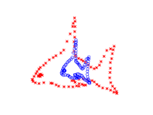
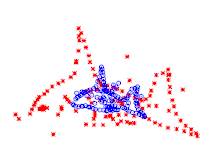
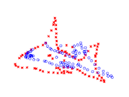

## Coherent Point Drift
This document explains the Coherent Point Drift algorithm as an alternative frame matching method for the ROI tracker.

The current matching assumes that a single connected region in the binary segmentation represents one ROI (and therefore one axon). The ROI "cutting" aims to solve this problem of touching axons that are segmented together, but relies on the assumption that these 2 axons are always segmented together on every single frame.

The case where the axons appear as touching on some frames but not on others is still a failure case, and the methods presented here might be a solution to it as they are independent of the "border" of background pixel around an ROI needs in order to be identified as a single axon.

### Point set registration
[Point set registration](https://en.wikipedia.org/wiki/Point_set_registration) is a computer vision process that aims to align two sets of points:

Making a parallel with the data, the red crosses in the illustration above could correspond to a detection frame, whereas the blue circles would be the tracker model. The model would then be registered to the frame to identify the ROIs.

In this setup, each pixels of the model and the frame could be a point in their respective sets. As single pixel would be registered, this becomes independent of the background border, and might be able to identify two axons touching on some frames but not all. However, its computational cost would greatly increase with respect to the number of pixels in the model and frame.

### Coherent Point Drift
The [Coherent Point Drift](https://ieeexplore.ieee.org/document/5432191) by Myronenko and Song (2010) is a point set registration algorithm based on a probabilistic approach using Gaussian Mixture Model (GMM). Briefly, the points of the model (blue circles) are considered to be the centroids of isotropic Gaussians, which are fitted to the frame (red crosses) using maximum likelihood. Moreover, the movement of the model's Gaussian are constrained to be "coherent", assuring a motion which preserves most of the original structure of the model's points.

Rigid, affine and non-rigid versions exists. Below are an example of the rigid and non-rigid CPD, with outlier points. (In order to deal with outliers, there is an additional uniform distribution ontop of the GMM that can account for data far away from the Gaussians.)

The Python implementation is based on [pycpd](https://github.com/kwohlfahrt/coherent-point-drift), with slight modification. It is available under `axoid.tracking.pycpd`.

A testing code is available at the very bottom of the jupyter notebook [`notebooks/tracking_test`](../notebooks/tracking_test.ipynb). It works by applying an initial rigid registration with only the translation term in order to broadly align the model with the frame, and then followed by a non-rigid registration to reffine the axons' positions and shape.  
In order to "fill" the ROIs (as all pixels of the frame might not overlap with pixels of the model), a simple watershedding is applied at the end.

### Possible extension
This work still being quite raw and needing refinements, it was not implemented in the final pipeline. However, its promissing results make it an interesting direction for improving the tracking.

A first noted drawback is the lack of constraint in the rigid/affine deformation. For the 2-photon data, scaling, flipping, or large rotation are not present. As these registration methods allows for this, they might find incorrect and bizarre registration for some frames in order to maximize the likelihood. The ad hoc solution for this was to limit them to pure translation. 
However, slight scaling or rotation, and shearing would help improve results. Being able to add some constraints might be beneficial, but not necessarily possible (see derivations in Myronenko 2009).

Additionally, and as discussed above, its computational cost is important. A possible solution would be to down sample the images prior to the matching, or the sub-sample the pixels of the model and/or frames. An extreme solution could be to limit the number of pixels to a certain small number (let say 10) of random pixels on the model, and fit only these to the frames. Pushing this forward, we can even imagine having only one point per model axons.

The problem is that CPD assumes isotropic Gaussians, which does not correctly represents the elongated shape of axons (which was stored in the pixels distribution when taking all pixels of the images). An idea to improve this would be to go towards "Coherent GMM". 
It would consists of fitting a Gaussian (with full covariance matrix) to each axon of the model, and then fitting this mixture to each frame by moving the Gaussians coherently (as in CPD). This is very simialr to the CPD algorithm, except that they took isotropic covariance matrices for the points in their derivation.

Therefore, the idea of fitting a full Gaussian per neuron seems promising, but will require some re-derivation of the equations to optimize the likelihood with coherence.
