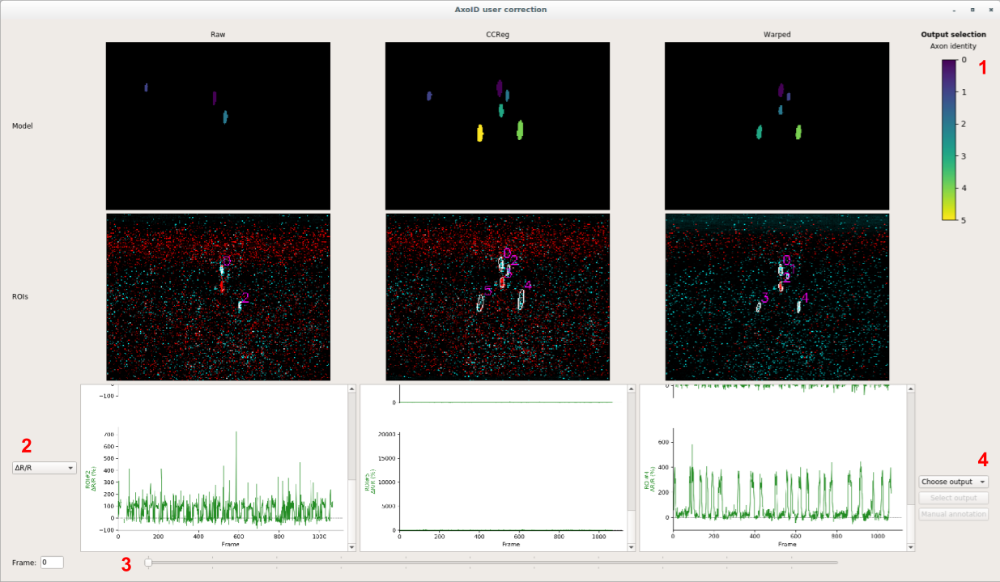
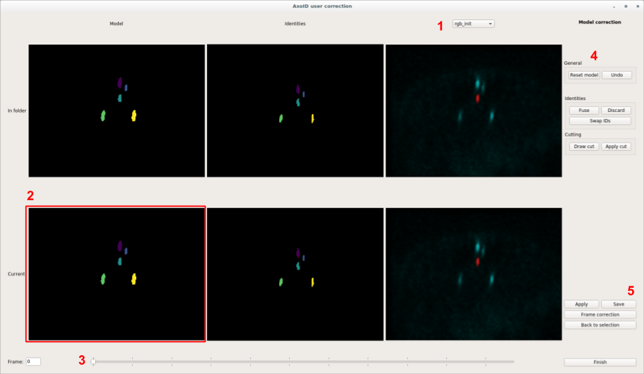
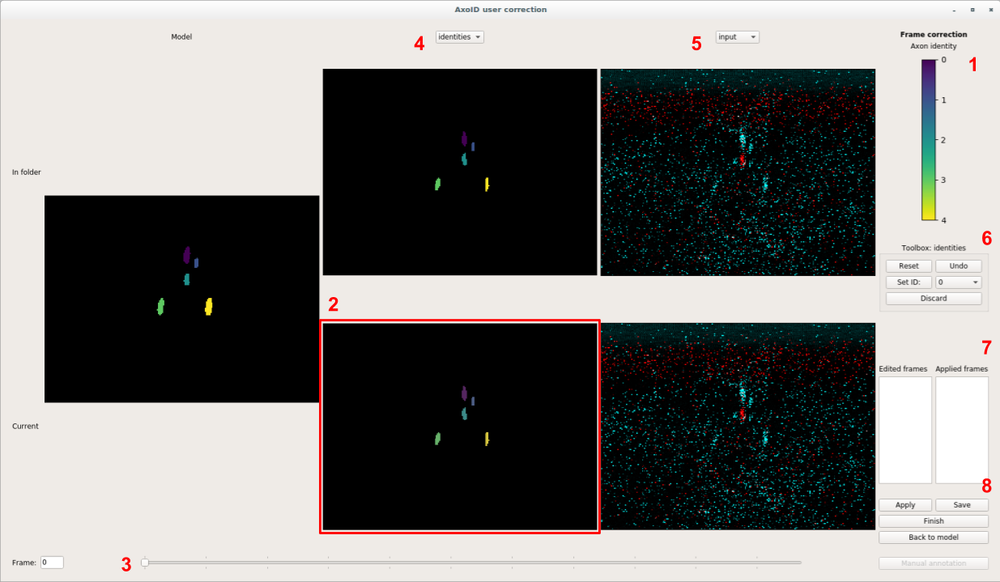
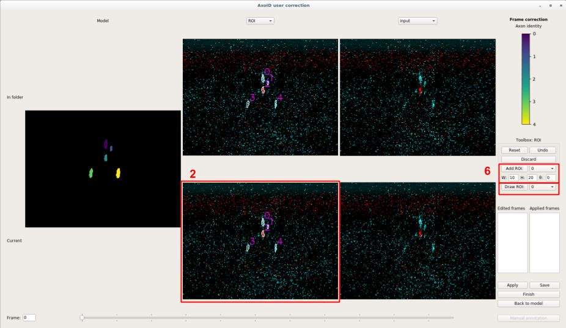
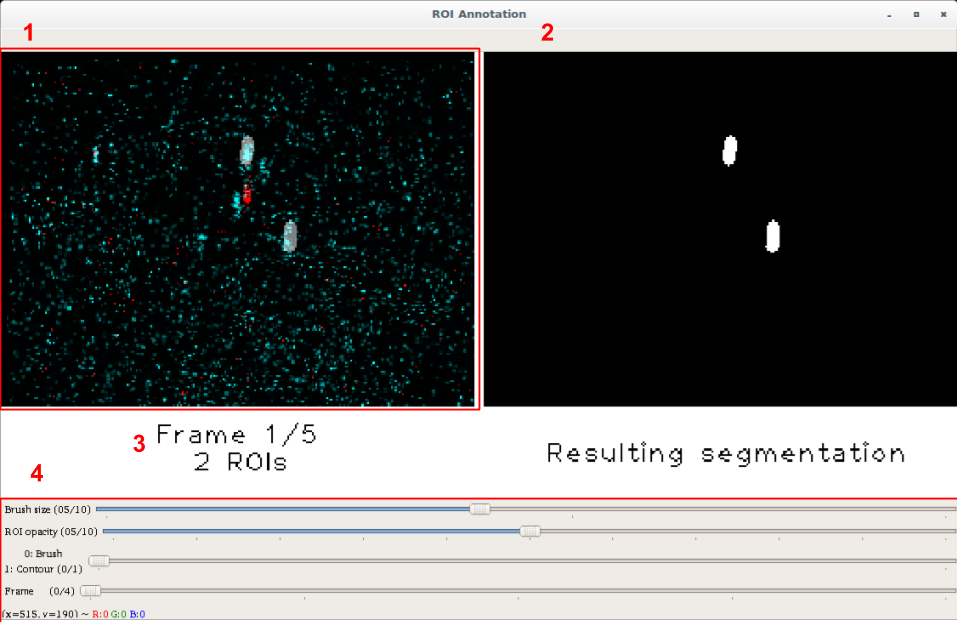

## How to use the GUI
Here is the manual of the different GUI pages. The GUI load data when changing pages, therefore it might be slightly slow.

**Note:** if you run the GUI through `ssh`, you might need the option `-X` or `-Y` to forward the window to your screen. Additionally, note that it might be slower than running the GUI from your own machine.

### Output selection
The first page of the GUI. Here, the user can explore the outputs of the main *AxoID* pipeline on the raw data (*raw*), the cross-correlation registered data (*ccreg*), and the optic flow warped data (*warped*). The goal here is to choose one of these outputs as the "final" output. It can be further corrected on the following pages.



The columns display the 3 different output (raw, ccreg, and warped). Each row corresponds to a different type of data:
  * the first one is the tracker model, i.e., how the tracker thinks the axons are organised. **1** Indicates the color mapping between axon identity and color (valid for model and identities)
  * the second row displays the contours of the ROIs over the input data
  * the last row can display different data, based on the dropdown choice **2** (see [Running AxoID](./Running.md) for description of the outputs)  
Under these, a slider **3** can be used to change the index of the frame being currently displayed.

Once the user has chosen an output to continue with, the menu **4** can be used:
  * the *Choose output* dropown is used to select one of raw, ccreg, or warped (note that if you already used the GUI on the experiment before, you will be able to continue working with the previous data by choosing *final* in this menu)
  * once a correct output is chosen, the *Select output* button should be enabled. Clicking it will save the chosen output to the `final/` folders (or do nothing if *final* was chosen), and the GUI will continue to the model correction page
  * **(not implemented, see below)** if no data is satisfactory, the user can rather choose to manually annotate a few frames and use these for fine tuning the network. The rest of the *AxoID* pipeline will be applied

### Model correction
This GUI page lets the user modify the tracker model, and then transfer the changes to the entire experiment. Available tools consist in fusing existing ROIs which would correspond to the same axon, discarding useless ROIs or misdetection (as trachea), and applying "cuts" to separate touching axons (see ROI cutting in [Pipeline](./Pipeline.md)).



The left display is now separated in two rows:
  * the top row corresponds to the data in the `final/` folders
  * the bottom row is the data being currently modified

The three columns display:
  * the tracker model
  * the identities of ROIs on the currently displayed frame (see slider **3**), the colors of the ROIs indicate their identity w.r.t. their model
  * different kind of data, where the **1** dropdown menu can be used to select which one to show

This page allows the user to modify the tracker model displayed in **2**, using the tools of the menu **4**. The different tools are:
  * General
    * *Reset model*: reset the model to the one in the `final/` folder (i.e., the one displayed in the top row)
    * *Undo*: undo the last change made to the model
  * Identities
    * *Fuse*: enable the fusing tool. In this mode, drawing over the model displays a red line which automatically select the ROIs that it has been drawn upon. When the left mouse button is released, all selected ROIs will be fused, effectively being set to the same ID. E.g.: if you want to fuse ROI 0 and ROI 1, select this tool, then draw a line passing over the two ROIs and then release the button
    * *Discard*: enable the discard tool. In this mode, drawing over an ROI will also select it, and when the left mouse button is released, all selected ROIs will be discarded (effectively setting them to background)
  * Cutting
    * *Draw cut*: enable the drawing of a cut. In this mode, the user can draw a "cut" on the model, a simple segment representing the cutting border of the ROI. It requires cutting one and only one ROI (if the cut is valid, the shown red segment will stay on the image as long as the *Draw cut* tool is selected).
    * *Apply cut*: apply the drawn cut to the model image, effectively making two ROIs out of the cutted one. This only works if a valid cut is drawn on the current model image

Note that all these changes are currently only applied to the model only. To apply them to the whole experiment, and then save the results, use the menu **5**:
  * *Apply*: apply the model changes to the entire experiment, also recomputing the fluorescence traces
  * *Save*: when the user is satisfied with the current results, this button save them to the `final/` folder, effectively over-writting the previous one (the top row will be updated with the newly saved data)
  * *Frame correction*: finish the model correction, and move on to the frame correction page. To be used when the user is satisfied with the saved results, but desires to edit some frames
  * *Back to selection*: go back to the output selection page
  * *Finish*: finish the model correction, and also terminate the GUI. To be used when the user is satisfied with the saved results, and does not want to edit single frames

### Frame correction
This page lets the user modify single frames of the results. It is possible to change the identity of the detected ROIs, and redraw/replace the ROIs over the frames. As before, it works by editing current results, then applying them, finally saving them on disk when satisfied.



The left display is similar to the model correction page, with few adjustment:
  * there is only one common model between the data in folder and the data being currently modified (see **1** for the common color mapping between ROI identity and color).
  * the second column is now where the editions take place (see **2**), and the different options can be chosen using the **4** dropdown menu. Note that changing this choice will also adapt the toolboxes **6**, see below:
    * identities: modify the identity of detected ROI
    * ROI: redraw the ROI over the frame
  * last column is still for displaying different kind of data, with the **5** dropdown menu

The slider **3** should be used to change the frame to be currently displayed and edited. The toolbox in **6** give access to the different tools to edit the frame, depending on the choice of **4**:
  * identities: the identity frame is displayed, with the segmentations overlayed ontop as light gray. Detected ROIs without identity can still be used with the following tools:
    * *Reset*: reset the identity frame to the one in the `final/` folder
    * *Undo*: undo the last change performed on the frame
    * *Set ID*: enable the tool to assign identity. Use the dropdown menu right of it to select the identity that you want to assign, and then click on the ROI that you want to set its ID. It can be used to exchange the ID of two ROIs by sequentially setting their identities to the other's
    * *Discard*: enable the discarding tool. With this tool enabled, click on an ROI to discard it (setting its identity to 0 -background-)
  * ROI: TODO + image



The display in **7** shows which frame has been edited (left), and which frame has been edited AND this edition has been applied to recompute the results (e.g. fluorescence) (right). Note that current version of the GUI (as of 1st July 2019) keeps edited frame in this display, even if the frame has been *reset* to the one in folder.

Similarly to last page, the tools in **8** allows for:
  * *Apply*: apply the editions made to the frames ("Edited frames" in **7**) to the results, and recompute fluorescence accordingly
  * *Save*: save the applied results ("Applied frames" in **7**) to the folder, effectively over-writting the `final/` folder (top row in the display will be updated accordingly)
  * *Finish*: finish the frame correction, and terminate the GUI. To use when the user is satisfied with the final results in folder
  * *Back to model*: go back to the model correction page
  * *Manual annotation*: **(not implemented, see below)** if results are not satisfying, go to the manual annotation page

### Manual annotation (not implemented)
The last last page of the GUI was to be about manually annotating a few frames (selected by the user), fine tuning the network on them, and repeating the process until the detections are satisfactory. Then, the tracking and fluorescence extraction would be applied.

By lack of time, it was however not implemented. Instead, there is a small independent annotation tool in `axoid`, currently to be used in interactive Python. It is `ROIAnnotator` in `axoid.detection.deeplearning.finetuning`.

`ROIAnnotator` is a custom class using OpenCV to display a small GUI where the user can draw the binary detection by hand. **Note**: as it requires drawing on a GUI, it also requires the `-X`or `-Y` flag for `ssh`. Moreover, it is better to launch it on your own computer rather than through `ssh` as it might be too slow.

The notebook `fine_tuning_test.ipynb` shows an example of using this tool to make annotations for fine tuning. 
Nonetheless, as the annotation had to be done outside of the notebook and the results loaded back to it, it is a bit messy, so below is an example of how to use this tool in Python.

#### ROIAnnotator tool
Here, the ROIAnnotator tool is presented in a short example.  
**Note**: OpenCV 3.1.0.5 (requirements of *AxoID* in `setup.py`) does not work with this. Making another conda environment with `axoid`, but installing manually OpenCV 4.1.0 afterwards solved the problem. By lack of time, *AxoID* was not tested with OpenCV 4.1.0, so it is not possible to tell if OpenCV could be simply upgraded to 4.1.0 in `setup.py`.

First, load the network, the dice metric, and the experimental data:
```python
import torch

from axoid.detection.deeplearning.model import load_model
from axoid.detection.deeplearning.metric import get_dice_metric
from axoid.utils.image import imread_to_float

device = torch.device("cuda:0" if torch.cuda.is_available() else "cpu")
model = load_model("AxoID/model/", input_channels="RG", u_depth=4, 
                   out1_channels=16, device=device)
metrics = {"dice": get_dice_metric()}

input_data = imread_to_float("exp/RGB.tif")
```
where `"AxoID/model/"` should be the path to the `model/` folder of this repository, and `"exp/RGB.tif"` the path to the experimental data as an RGB TIFF stack of images.

Then, choose which frame you want to annotate. It can be randomly, or by visually inspecting the frames:
```python
indices = [18, 120, 451, 678, 923]
annot_input = input_data[indices]
```

Finally, start the annotator GUI on these frames:
```python
from axoid.detection.deeplearning.finetuning import ROIAnnotator

annotator = ROIAnnotator(annot_input)
```
This will open a window for the annotation. Note that the Python object `annotator` created above will keep all the information and can be used to reopen the window (using `annotator.main()`).



The left image in **1** is the current input frame, and is where the user can draw the ROIs. The right image **2** is a display of the resulting binary detection image. The informations in **3** display the current frame number being annotated over the total number of frame to annotate, as well as the number of ROIs present on the current annotation.

The tools in **4** are:
  * *Brush size*: size of the circular brush in pixels
  * *ROI opacity*: opacity of the ROI over the input image in **1**, purely for display
  * *Mode*
    * *0:Brush*: enable the brush tool, letting the user "draw" the ROI with a paintbrush (see *Brush size* above)
    * *1:Contour*: enable the contour tool, the user draws the contour of an ROI which is automatically filled
  * *Frame*: slider for navigating easily through the frames.

Additionally, a few keys have bindings:
  * *ESC*: escape quit the window. **Note**: closing the window with the top-right "x" is not sufficient, so use ESC instead (the window can be restarted by runnning `annotator.main()` in Python)
  * *backspace*: undo the last change
  * *enter*: go to the next frame, and terminate the annotation if it were the last one
  * *1* to *9*: navigate the first frames (*1* to go to the first one, *2* the second one, etc.)
  * *P*: go to the Previous frame
  * *N*: go to the Next frame (does not terminate the annotation if it is the last frame)


`ROIAnnotator` also allows for:
  * appending images to the annotator: `annotator.add(new_images)`
  * manually setting the segmentations of the annotator with existing ones: `annotator.set_segmentations(new_segs)`, which can be useful to reuse the network prediction and draw on them

Then, when the annotations are finished, train and validation sets have to be made:
```python
annot_segs = annotator.segmentations

n_train = 3
n_valid = len(indices) - n_train

input_train = annot_input[:n_train]
input_valid = annot_input[n_train:]
seg_train = annot_segs[:n_train]
seg_valid = annot_segs[n_train:]
```

And finally, the fine tuning can be launched on them (we create the pixel-wise weights, but disable the "contour" weighting as the contours might no be very precise):
```python
from axoid.detection.deeplearning.data import compute_weights
from axoid.detection.deeplearning.finetuning import fine_tune

weights_train = compute_weights(seg_train, contour=False, separation=True)

model_ft = fine_tune(model, input_train, seg_train, weights_train, input_valid, seg_valid, 
                     data_aug=True, n_iter_max=1000, patience=200, batch_size=16, 
                     learning_rate = 0.0005, verbose=1)
```
