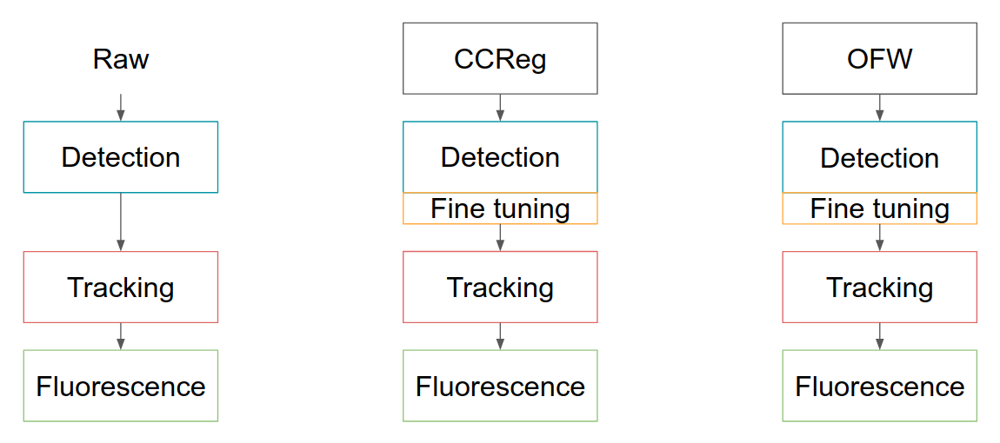
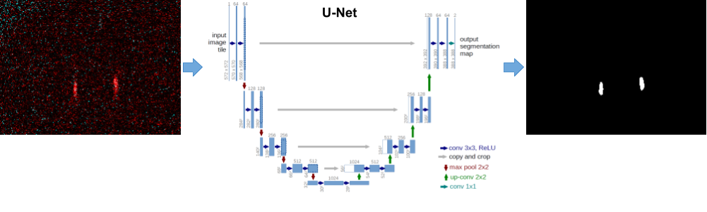

## AxoID pipeline
The main pipeline consists in detection, tracking, and fluorescence extraction:
  1. **Detection**: detect axons over the frames as a binary segmentation. This part outputs a stack of binary images where black is background, and white is ROI
  2. **Tracking**: track axon identities over time by linking the different ROIs between the frames. The output is a stack of greyscale image, where 0 is still background, and 1 and above corresponds to axon identities. I.e., all ROI with value 1 are the same axon through time, all ROI with value 2 are the same second axon through time, and so on.
  3. **Fluorescence extraction**: Extract the fluorescence value of each axon through the frames by computing the average intensity in its ROI. Then, compute the fluorescence traces as dF/F and dR/R.

**Note:** In order to improve the results, this pipeline is actually applied 3 times: once over the raw data, once over the cross-correlation registered data, and once over the warped data.  
Therefore, it outputs 3 different results. The user can use the GUI to more easily choose which one he wants to use.

### Detection
The deep network takes a frame as input, and outputs a binary image with the ROIs segmented over the background.
It is applied to the entire experiment to get a stack of segmentations. Then, ROIs with size below a minimum (e.g. 11 pixels) are discarded.

#### Fine tuning 
Optionally, the network can be fine tuned on a few frames of the experiment to try and improve its performance on this single experiment only. In order to do this automatically, it needs a few frames with generated ground truths.

For this, it will look for "similar frames" -frames that have the axons at the same place on the images- and take them as input for the fine tuning.  
In order to create ground truths, it take the average of these frames (with possible smoothing if there are not many frames) and segment it using local thresholding. This segmentation will serve as ground truths for all of these similar frames. (Having *similar* frames is therefore useful to get a sharper projection, thus helping the segmentation, and then having the ROIs aligned with the ground truths).

**Note:** the fine tuning is applied to the cross-correlation registered (*ccreg*) and optic flow warped (*warped*) data, but not on the raw data. For the raw data, the original network is directly used.

### Tracking
The tracker works by creating an "internal model" -a model of how the axons should be on the frame- and then matching each frame to this model. This matching tries to link the ROIs of the frame to the axon of the model.  

#### Initialization
The model is first initialized with a single frame. In order to do this, there is 2 options:
  * *If there was fine tuning:* then the average of the similar frames and its segmentation are used as initializer
  * *If there wasn't fine tuning*: one frame of the experiment is automatically selected. To do this, it considers frames with a number of ROI equal to the number of ROI which is the most frequent over the frames, and then select the frame with the highest cross-correlation with the average of these frames. It also takes its segmentation, as outputed by the detection.

#### Model updating
The model is then updated by iterating between matching a frame, then using the newly tracked frame to update the model axons properties (e.g., their sizes and position).  
This is repeated by passing a few time through the experiments (typically 1-5 times).

#### Frame matching
In order to match the ROIs of the frame with the axons of the model (with possibly appearing or disappearing ROIs), a cost is created and the Hungarian assignment method is used to find the optimal assignment.

The cost of assigning an ROI to an axon is actually defined using an inner assignment. It is the cost of assigning all other ROIs to all other axons, if we assumes that these two are the same.

#### Identity prediction
Finally, after updating the model, it is kept as it is and each segmentation frame of the experiment is matched a last time with it, in order to get the final identities.

#### Region of interest "cutting"
AxoID also tries to find region of interest which could actually corresponds to 2 different axons that are touching or really close on the experimental frames, and then separate the 2. This is only performed if *there was fine tuning* at the detection stage.

To do so, it looks for "cuts" -line dividing an ROI in 2 subROI- by using the average of the "similar frames". It actually recomputes the segmentation, but this time while finding local maxima to get individual axons. By comparing the former segmentation with this new one, it sees if there are some potential "cuts".

To then cut the ROI on all frames of the experiment, an ellipse is fitted to it for each frame. This cut is then applied at the same place on the ellipses. This is performed as a post-processing of the identities.

### Fluorescence extraction
The fluorophore time series are computed by taking the average of non-zero pixels in the ROI over time.  
ΔF/F and ΔR/R are then computed by first finding the baselines F0 and R0.

If an ROI is absent on a frame, its fluorscence will be reported as NaN (Not a Number).
